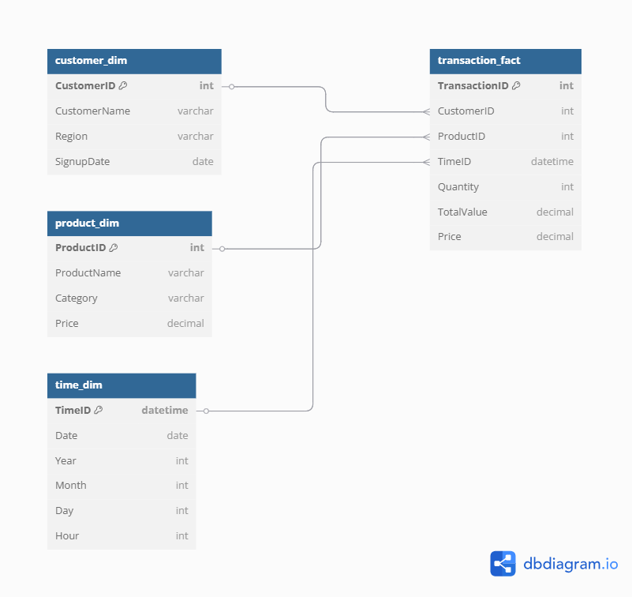

# OLAP a Data Mining (KI/ODM – 2025)

Tento projekt demonstruje využití nástroje **DuckDB** jako OLAP databáze v kombinaci s analytickým a dataminingovým zpracováním dat pomocí Pythonu. Datová sada vychází z e-commerce transakcí.

## ERD



## 📦 Struktura projektu

```
.
├── data/                  # CSV a Excel datové soubory
├── sql/                  # SQL skripty pro vytvoření a dotazování
├── python/               # Python skripty pro načítání, analýzu a vizualizaci
├── olap_vystupy/         # Výsledky jednotlivých dotazů (txt + csv)
├── olap_vystupy/grafy/   # Vizualizace výsledků dotazů
├── vizualizace/          # Výstupy klasifikačních metod (confusion matrix)
├── output/               # Shrnutí výsledků data miningu
├── obrazky/              # ER diagram
├── ecommerce.duckdb      # DuckDB databázový soubor
├── requirements.txt      # Závislosti
└── README.md
```

## 🛠️ Příprava prostředí

1. (Volitelné) Vytvořte a aktivujte virtuální prostředí:
   ```bash
   python -m venv venv
   source venv/bin/activate  # nebo venv\Scripts\activate ve Windows
   ```

2. Nainstalujte knihovny:
   ```bash
   pip install -r requirements.txt
   ```

## 🧱 OLAP část (Data Warehouse)

1. Vytvoření tabulek a načtení dat:
   ```bash
   python python/run_sql.py
   ```

2. Spuštění OLAP dotazů:
   ```bash
   python python/run_queries.py
   ```
   Výstupy se uloží do složky `olap_vystupy/` ve formátu `.csv`, `.txt`.

3. Zobrazení grafů k dotazům:
   ```bash
   python python/graphs.py
   ```

## 🧠 Data Mining část

1. Spusťte klasifikaci:
   ```bash
   python python/data_mining.py
   python /python/regrese.py
   ```

2. Výsledky:
   - Textový výstup: `output/classification_results.txt`
   - Vizualizace (confusion matrix): `vizualizace/`

## 📑 Dokumentace

Projekt doplňuje dokumentace `ODM25_SoukupMichal.pdf`, která obsahuje:
- úvodní stranu s náležitostmi,
- popis nástrojů, postupu a výstupů,
- ER diagram,
- obrázky a citace dle ISO 960.

---

## ✅ Požadavky k zápočtu

| Požadavek                     | Stav       |
|------------------------------|------------|
| Použití nástroje DWH         | ✅ DuckDB  |
| Instalace OLAP a DBMS        | ✅ Lokálně |
| Výběr dat                    | ✅ CSV s časem |
| Struktura (hvězda)           | ✅ `create_tables.sql` |
| 4 OLAP dotazy + výstupy      | ✅ CSV, TXT, PNG |
| Data mining                  | ✅ `data_mining.py` |
| Dokumentace + obrázky        | ✅ Součástí projektu |

